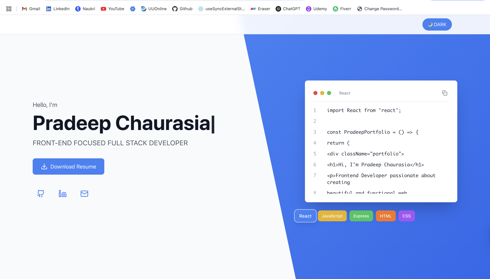
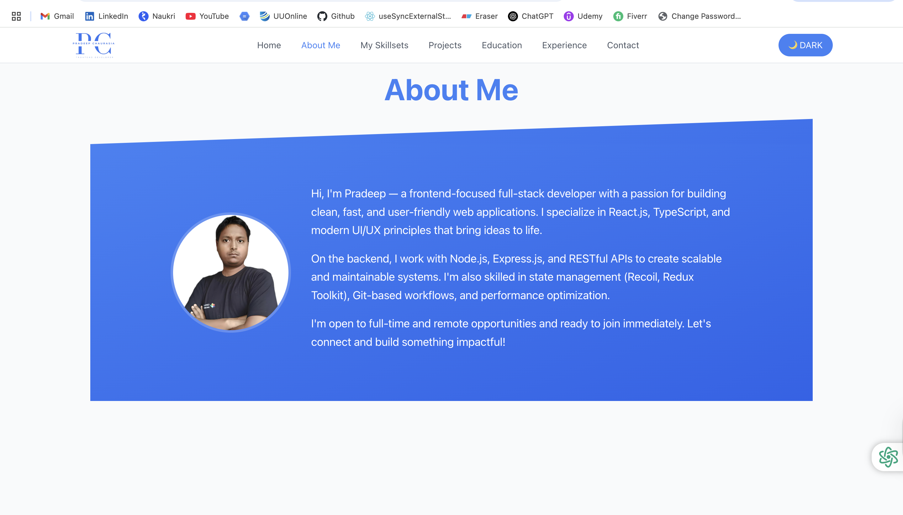
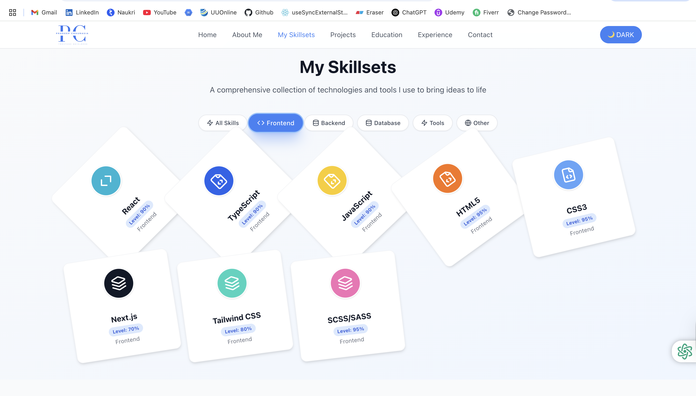

# Portfolio Website

A modern, responsive portfolio website built with React, TypeScript, and Tailwind CSS. Features smooth animations, interactive components, and a beautiful user interface.

## 📸 Screenshots

### Desktop View


_Hero section with animated tech cards and smooth scrolling_


_Projects showcase with hover effects and descriptions_


_Interactive skills section with category filtering and rotation animations_

## 🚀 Features

### Core Features

- **Responsive Design**: Fully responsive layout that works on all devices
- **Dark Mode Support**: Toggle between light and dark themes
- **Smooth Animations**: GSAP-powered animations with ScrollTrigger
- **Interactive Components**: Engaging UI elements with hover effects
- **Contact Form**: EmailJS integration for sending emails
- **PDF Download**: Resume download functionality
- **Confetti Effects**: Celebratory animations for user interactions

### Sections

- **Hero Section**: Animated introduction with interactive tech cards
- **About**: Personal information and background
- **Experience**: Work history with timeline
- **Education**: Academic background
- **Skills**: Interactive skill cards with category filtering
- **Projects**: Portfolio projects with descriptions
- **Contact**: Contact form with EmailJS integration

### Animations

- **GSAP ScrollTrigger**: Scroll-based animations for all sections
- **Interactive Tech Cards**: Code snippets with copy functionality
- **Skill Card Animations**: Left-to-right entrance with continuous rotation
- **Confetti Rain**: Particle effects for celebrations
- **Smooth Scrolling**: Lenis integration for buttery smooth scrolling

## 🛠️ Technologies Used

### Frontend

- **React 18**: Modern React with hooks and functional components
- **TypeScript**: Type-safe development
- **Tailwind CSS**: Utility-first CSS framework
- **Vite**: Fast build tool and development server

### Animation & Effects

- **GSAP**: Professional-grade animations
- **ScrollTrigger**: Scroll-based animation triggers
- **Lenis**: Smooth scrolling library
- **EmailJS**: Email service integration

### Icons & UI

- **Lucide React**: Beautiful, customizable icons
- **Custom CSS**: Tailored animations and effects

## 📦 Installation

### Prerequisites

- Node.js (version 16 or higher)
- npm or yarn package manager

### Setup Instructions

1. **Clone the repository**

   ```bash
   git clone <repository-url>
   cd portfolio
   ```

2. **Install dependencies**

   ```bash
   npm install
   ```

3. **Set up environment variables**
   Create a `.env` file in the root directory:

   ```env
   VITE_EMAILJS_SERVICE_ID=your_emailjs_service_id
   VITE_EMAILJS_TEMPLATE_ID=your_emailjs_template_id
   VITE_EMAILJS_PUBLIC_KEY=your_emailjs_public_key
   ```

4. **Start development server**

   ```bash
   npm run dev
   ```

5. **Open in browser**
   Navigate to `http://localhost:5173`

## 🚀 Available Scripts

```bash
# Start development server
npm run dev

# Build for production
npm run build

# Preview production build
npm run preview

# Run linting
npm run lint

# Fix linting issues
npm run lint:fix

# Format code with Prettier
npm run format

# Type checking
npm run type-check
```

## 📁 Project Structure

```
portfolio/
├── public/                 # Static assets
├── src/
│   ├── components/         # React components
│   │   ├── About.tsx      # About section
│   │   ├── Contact.tsx    # Contact form
│   │   ├── Education.tsx  # Education section
│   │   ├── Experience.tsx # Experience timeline
│   │   ├── Header.tsx     # Navigation header
│   │   ├── Hero.tsx       # Hero section
│   │   ├── Projects.tsx   # Projects showcase
│   │   ├── Skills.tsx     # Skills with animations
│   │   └── ConfettiRain.tsx # Confetti effects
│   ├── contexts/          # React contexts
│   │   └── ThemeContext.tsx # Dark/light theme
│   ├── data/              # Static data
│   │   └── portfolioData.ts # Portfolio content
│   ├── hooks/             # Custom hooks
│   │   └── useGSAP.ts     # GSAP animation hook
│   ├── styles/            # CSS styles
│   │   └── App.css        # Global styles
│   ├── types/             # TypeScript types
│   │   └── index.ts       # Type definitions
│   ├── App.tsx            # Main app component
│   ├── main.tsx           # App entry point
│   └── index.css          # Tailwind CSS imports
├── .eslintrc.js           # ESLint configuration
├── .prettierrc            # Prettier configuration
├── package.json           # Dependencies and scripts
├── tailwind.config.js     # Tailwind configuration
├── tsconfig.json          # TypeScript configuration
└── vite.config.ts         # Vite configuration
```

## 🎨 Customization

### Adding New Sections

1. Create a new component in `src/components/`
2. Add the component to `src/App.tsx`
3. Update navigation in `src/components/Header.tsx`

### Modifying Data

- Edit `src/data/portfolioData.ts` to update content
- All text, links, and images can be customized here

### Styling

- Use Tailwind CSS classes for styling
- Custom CSS in `src/styles/App.css`
- Theme colors in `tailwind.config.js`

### Animations

- GSAP animations in individual components
- Custom animation hook: `src/hooks/useGSAP.ts`
- ScrollTrigger configurations for scroll-based effects

## 🔧 Configuration

### EmailJS Setup

1. Create an account at [EmailJS](https://www.emailjs.com/)
2. Set up email service and template
3. Add environment variables to `.env` file

### GSAP Animations

- Modify animation parameters in component files
- Adjust ScrollTrigger settings for different effects
- Customize easing functions and durations

### Theme Customization

- Edit `src/contexts/ThemeContext.tsx` for theme logic
- Modify color schemes in `tailwind.config.js`
- Update CSS variables in `src/styles/App.css`

## 🚀 Deployment

### Vercel (Recommended)

1. Push code to GitHub
2. Connect repository to Vercel
3. Deploy automatically

### Netlify

1. Build the project: `npm run build`
2. Upload `dist` folder to Netlify
3. Configure build settings

### GitHub Pages

1. Install gh-pages: `npm install --save-dev gh-pages`
2. Add deploy script to `package.json`
3. Run: `npm run deploy`

## 📝 Contributing

1. Fork the repository
2. Create a feature branch
3. Make your changes
4. Run linting and formatting
5. Submit a pull request

## 📄 License

This project is open source and available under the [MIT License](LICENSE).

## 🤝 Support

For questions or support, please open an issue on GitHub or contact the maintainer.

---

**Built with ❤️ using React, TypeScript, and Tailwind CSS**
